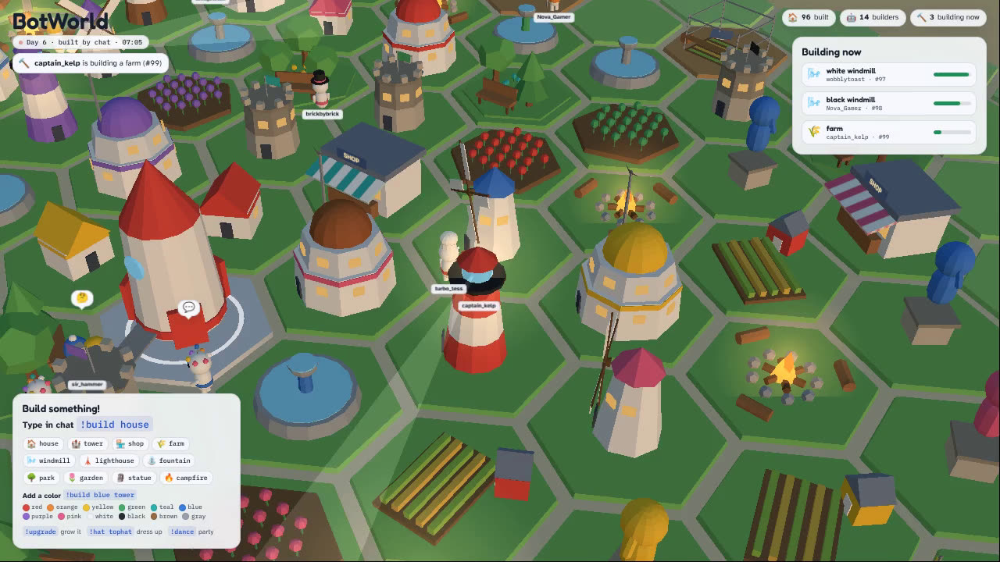

# BotWorld

A 24/7 Twitch stream where chat builds a world together. Type `!home` in chat and your own little bot lands, gets its own home in your colour, and then helps the whole chat build a town: someone starts a project (`!build woodcutter`), everyone helps (`!help`), and the more bots help, the faster it rises. Built in the style of Botdorp, in English.

The town sits in the middle of a big world (about ten times the old island), with forests, berry meadows, rocky hills, mountains with coal and iron, lakes, rivers and a sea coast. Everything beyond the first few fields is fog until a bot explores it with `!explore`, like in Age of Empires. It starts with sticks and stones and, over about two months, works its way through six eras up to a glowing future city with fusion reactors. Every era has a wonder that the whole chat builds together.


## Try it in two minutes

You need [Node.js 22 or newer](https://nodejs.org) (the LTS installer is fine on Windows).

```bash
npm install
npm run demo
```

Open **http://localhost:3000**. `demo` invents pretend viewers who build things, so you can watch the town grow without being live. The bar at the bottom lets you type commands yourself as any name. If the panels look tiny, the browser is zoomed out: press Ctrl and 0 to go back to 100%.

Want to see a later era right away? Grow a world in pretend time and open it:

```bash
npm run balance -- --untilEra=3 --save=data-preview
npm start -- --data=data-preview
```

`/gallery.html` shows every building of every era side by side.

## Read your real Twitch chat

```bash
npm start -- --channel=your_channel_name
```

Or copy `botworld.config.example.json` to `botworld.config.json`, fill in your channel and run `npm start`. Reading chat needs no password, token or Twitch app: BotWorld joins chat anonymously and read only.

The world is saved in `data/world.json` (with a dated copy in `data/backups/` every day), so you can stop and start BotWorld any time. Builds that finished while it was off are caught up on the next start. A world saved by the first version of BotWorld (before eras) is upgraded automatically.

## Go live with OBS

1. Run `npm start -- --channel=your_channel_name`.
2. In OBS add a **Browser** source:
   * URL `http://localhost:3000/?stream=1&sound=1`
   * Width `1920`, height `1080`, FPS `30`
   * Tick **Control audio via OBS**
3. Stream to Twitch as usual (Settings > Stream). Use a keyframe interval of 2 seconds.

The `?stream=1` view hides the test bar and lets the camera direct itself: it flies to every new build, follows bots to work, watches storms and finished wonders, and tours the town when chat is quiet. The sky follows the real clock and the seasons (snow in winter), so nights are dark with lit windows and street lights. Every time a new era starts there is a big banner and a timelapse of how the town grew.



On screen: goods in storage along the top (with how fast they change), the era panel on the right (the three goals for the next era and what the town is short of), what is being built, the top builders of the week, the how-to card with this era's buildings and their costs, the ticker, chat votes and events, `!me` cards and the Gazette headline.

## Chat commands

| Command | What happens |
| --- | --- |
| `!home` | Your bot lands and builds your own home, with a flag and a rim in your colour |
| `!build woodcutter` | Start a town project (at most 3 at a time). Any building of this era or earlier, optionally in a colour |
| `!help` | Your bot helps build the project that needs it most for 40 seconds. `!help #12` for a certain one |
| `!help wonder` | Haul goods to the era's wonder |
| `!wood` | One trip: your bot cuts trees in a forest and carries the wood to town (also `!chop`) |
| `!stone` | One trip to break stone in the rocky hills (also `!mine`) |
| `!food` | One trip to pick berries in a meadow, or `!fish` by the water |
| `!coal`, `!iron` | From the Medieval Town: dig ore at a deposit the scouts found |
| `!wood 3` | Do it three times in a row (works for every job, up to 5) |
| `!work bricks` | Help at a building that makes a good from other goods: `bricks`, `steel`, `parts`, `chips` |
| `!explore` | Your bot scouts the fog and reveals new land. `!explore north` (or east, south, west, ne, ...) |
| `!build outpost` | Start an outpost out in the world, near rich land (`!build outpost west` picks the way). Producers near a store work at full speed |
| `!upgrade woodcutter` | Start a town project that takes a building up a level (also `!upgrade #12`). Three levels, each makes 50% more |
| `!upgrade tools` | Better tools for your bot: a bigger load on every trip and faster building. Needs a level, the right era and a few goods |
| `!upgrade` | Make your home bigger (three levels per era) |
| `!stop` | Your bot stops and forgets the jobs lined up |
| `!repair` | Fix a building broken by a storm or blackout |
| `!vote 1` or `!1` | Vote in a chat vote |
| `!me` | Show your card, put a beacon in your colour over your bot and fly the camera to it |
| `!hat tophat` | Dress your bot (more hats unlock as you level up) |
| `!dance` | Your bot throws a little party |
| `!commands` | Shows the commands on screen |

Moderators and the broadcaster also have `!remove #12` (any build), `!vote start` (start a vote now) and `!event storm` (start an event: festival, harvest, tallTrees, richVeins, merchant, meteor, builderRush, storm, blackout).

Every job is short (about half a minute), so chat can keep typing and see what it did: the goods pop up over the bot when it comes back, and so does every bit of XP. Typed while the bot is busy, jobs wait in line (the number shows next to its name).

On screen, the **What to do now** box always says the next step for chat, with the command to type, and the how-to card takes turns showing the commands, where every good comes from and this era's buildings.

## The game

In short (all the details and numbers are in [docs/GAME_DESIGN.md](docs/GAME_DESIGN.md)):

* **Town projects.** Every building except your home is built by the whole town. Bots who `!help` add their work; the townsfolk always help a little, so projects finish even when chat sleeps.
* **Gathering by hand.** `!wood`, `!stone`, `!food`, `!coal` and `!iron` send your bot on a trip to chop, mine or pick on the right land, and it carries the load back to the nearest store: 2 goods with stone tools, up to 8 with laser tools. There is always something useful to do, even before the first woodcutter stands.
* **The whole world.** Outposts take the town out over the map. Producers more than 4 tiles from a store (the pad, a stockpile, barn, warehouse or outpost) make a tenth less per extra tile, so chat builds outposts near the forests, hills and ore far away. Roads with little mule carts run from every outpost back to town.
* **The rival.** Cogsworth, an AI town on the far side of the world, plays by the same rules: it gathers, builds, upgrades, sends out outposts and climbs the eras. Land near its buildings is its own, so both towns race for the forests and ore deposits in between. The **Race to the Future** panel shows who leads; chat finds Cogsworth by exploring (it is shown on the map once found). The rival leans towards a close race: it speeds up a little when chat is far ahead and slows down when chat is behind.
* **Upgrades.** Every town building can go up to level 3 (`!upgrade woodcutter`), which makes 50% more per level and shows as pennants on the building. Bots get better tools with `!upgrade tools` as their viewer levels up.
* **The land matters.** A woodcutter needs a forest next to it, a quarry rocky hills, a gatherer a berry meadow, a fisher water, a mine a coal or iron deposit. The richer the spot, the more it makes. Scouts (`!explore`) find new land, ore, ruins with goods and old tablets with knowledge.
* **Goods.** Woodcutters, quarries, farms, kilns, mines, steel mills, factories and chip fabs make the goods that buildings cost. Some need other goods (a kiln turns stone and wood into bricks), workers (people from the homes) and later electricity. Storage limits how much the town can keep.
* **People** move into homes when there is food and the town is not miserable. Parks, fountains, statues and stadiums make them happier, and happy towns work faster.
* **Power** from the Industrial Age: coal plants, wind turbines, solar farms (only by day) and fusion. Factories and skyscrapers stop without it.
* **Eras.** To move on, a town needs enough people, the era's wonder finished and a full knowledge bar, which takes about 11 days (campfires, schools and labs speed it up). Old buildings, homes too, then rebuild themselves in the new style.
* **Viewers** earn XP and levels for everything they do (helping, exploring, hauling), which unlock hats. A weekly leaderboard keeps it fresh.
* **Votes and events** every hour or so: festivals, harvests, a merchant ship, meteor showers, storms that break buildings until chat repairs them.

## The Gazette

Every 30 minutes a newspaper headline about the town appears at the bottom of the stream ("Storm batters the town, 3 buildings hit. Repair crews wanted"). It works out of the box with headline templates.

To let Claude write the headlines, set an [Anthropic API key](https://console.anthropic.com) before starting:

```bash
ANTHROPIC_API_KEY=sk-ant-... npm start -- --channel=your_channel_name
```

It uses Claude Opus 5.5 with low effort, one short request every half hour, and falls back to the templates whenever the API is not reachable. Viewer names are passed to Claude as data only. Requests opt into server side fallbacks, so if a request is ever declined it is retried on another Claude model before BotWorld gives up and uses a template. Settings are under `gazette` in the config file (`everyMin`, `ai`: `"auto"`, `true` or `false`, and `model`).

## Keeping it fair and safe while nobody is watching

A chat that controls the screen will try to break it, and Twitch holds you responsible for what is on your stream. BotWorld is built so that is hard to do:

* Chat can only pick from fixed lists of buildings, colors, goods and hats. No chat text is ever drawn on screen, except Twitch usernames (which Twitch already moderates).
* One home per viewer, at most one project per founder and 3 town projects at a time, and at most 8 helpers on one project.
* Mistakes get one friendly on-screen hint per viewer per 20 seconds, so spam cannot flood the screen.
* Mods can `!remove #id` anything.

For an unattended channel also turn on Twitch AutoMod, add a couple of trusted moderators, and consider followers-only chat (for example 10 minutes).

## Going 24/7

Pick the machine that runs it all day:

1. **Your own PC or a small mini PC at home with OBS** (simplest, smooth 30 fps with any graphics chip). Leave `npm start` and OBS running.
2. **A Linux server without a screen.** `stream/stream.sh` opens the stream view on a virtual display and sends it straight to Twitch with ffmpeg, restarting either part if it stops:

   ```bash
   sudo apt install xvfb chromium ffmpeg fonts-noto-color-emoji
   npm install
   npm start -- --channel=your_channel_name &
   TWITCH_STREAM_KEY=live_xxxxx ./stream/stream.sh
   ```

   Without a graphics card the 3D is drawn by the CPU, which gets slow once the town is a big city. Use `quality=low`, or better a machine with a GPU, or option 1. In this mode the stream is currently silent.

To survive reboots, run both with a service manager (systemd on Linux, or Task Scheduler on Windows). The page also reloads itself every night at 4:00, and after any graphics hiccup.

## Settings

| Setting | Where | Default |
| --- | --- | --- |
| Channel | `--channel=name`, `TWITCH_CHANNEL`, or `channel` in the config file | none (no Twitch) |
| Port | `--port=3000`, `PORT` | 3000 |
| Data folder | `--data=folder`, `BOTWORLD_DATA` | `data` |
| Pretend viewers | `--simulate`, `BOTWORLD_SIMULATE=1` | off |
| Days per era | `--era-days=11`, `BOTWORLD_ERA_DAYS`, or `pace.eraDays` | 11 (about 2 months in all) |
| Where the world is (sun, solar power) | `geo.lat`, `geo.lon` | 52.2, 5.1 (the Netherlands) |
| Gazette | `gazette.everyMin`, `gazette.ai`, `gazette.model`, `ANTHROPIC_API_KEY` | every 30 min, Claude when a key is set |
| Limits | `limits` in the config file: `maxProjects`, `maxHelpers`, `voteEveryMin`, `queueMax`, `shiftSec` and more | see `server/world.js` |
| The rival town | `limits.rival` (`false` turns it off), `limits.rivalDifficulty` (1 is normal, 0.7 easier, 1.3 harder) | on, 1 |

Page options: `?stream=1` broadcast view (press Esc, or the button that shows when you move the mouse, to leave it), `&sound=1` start with sound, `&quality=low` no shadows, `&time=21:30` pretend it is that time of day.

## How it works

```
Twitch chat ──> server/twitch.js ──> server/commands.js ──> server/world.js ──> data/world.json
                                                           (economy.js, gazette.js)
                                                                 │
                                                       events over /events (SSE)
                                                                 ▼
                         public/js/main.js ──> world3d.js + buildings.js (Three.js) + hud.js (overlay)
```

* **The server owns the world.** It runs the economy every 5 seconds, picks plots (homes near parks, producers at the edge, every viewer's builds cluster into a neighborhood), times builds and jobs, runs votes and events, decides when an era ends, and saves.
* **The page only animates.** It gets a full snapshot when it connects and then every change as it happens, so OBS can reload it at any time without losing anything.
* `public/shared/` holds the catalog (eras, goods, buildings, events, hats), the hex grid and the sun, used by both sides.

## Development

```bash
npm test                                  # rules, economy, eras, chat, gazette
npm run balance -- --viewers=5            # play two months in a few seconds
npm run balance -- --viewers=30 --eraDays=10
```

`POST /api/chat` with `{"user": "name", "text": "!build house"}` sends a test message (only accepted from the same computer). `GET /health` reports uptime, Twitch status, the era and the number of builds. In the browser console, `botworld.debug()` shows what every bot and building is doing.

## Next steps

* Live test with real chat on your channel.
* Sound in the headless server stream (a PulseAudio virtual sound card).
* A chat bot account that answers in chat ("@name your house is #12"), which needs a Twitch token.
* Channel points and bits (for example "start a festival" as a channel point reward), through Twitch EventSub with a token.
* A new world (season 2) after the finale, with the old one kept as a timelapse.
* If Twitch ever retires anonymous chat reading, switch `server/twitch.js` to EventSub with a token.
