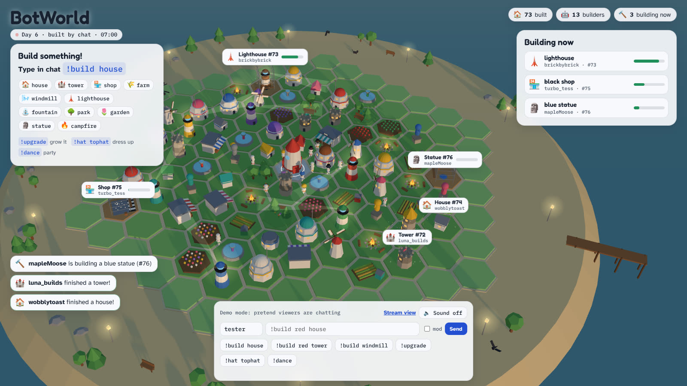

# BotWorld

A 24/7 Twitch stream where chat builds an island village. Type `!build house` in chat and your own little bot lands on the island, walks to a free plot and builds it while everyone watches. Built in the style of Botdorp, in English, starting from a clean, empty island.



## Try it in two minutes

You need [Node.js 22 or newer](https://nodejs.org) (the LTS installer is fine on Windows).

```bash
npm install
npm run demo
```

Open **http://localhost:3000**. `demo` invents pretend viewers who build things, so you can watch the island grow without being live. The bar at the bottom lets you type commands yourself as any name.

## Read your real Twitch chat

```bash
npm start -- --channel=your_channel_name
```

Or copy `botworld.config.example.json` to `botworld.config.json`, fill in your channel and run `npm start`. Reading chat needs no password, token or Twitch app: BotWorld joins chat anonymously and read only.

The world is saved in `data/world.json` (with a dated copy in `data/backups/` every day), so you can stop and start BotWorld any time. Builds that finished while it was off are caught up on the next start.

## Go live with OBS (step 1)

1. Run `npm start -- --channel=your_channel_name`.
2. In OBS add a **Browser** source:
   * URL `http://localhost:3000/?stream=1&sound=1`
   * Width `1920`, height `1080`, FPS `30`
   * Tick **Control audio via OBS**
3. Stream to Twitch as usual (Settings > Stream). Use a keyframe interval of 2 seconds.

The `?stream=1` view hides the test bar, shows the how-to-play card, and lets the camera direct itself: it flies to every new build, follows bots as they walk to work, celebrates finished buildings, and tours the island when chat is quiet. The sky follows the real clock, so nights are dark with lit windows, stars and lighthouse beams.


## Chat commands

| Command | What happens |
| --- | --- |
| `!build house` | Your bot lands (first time) and builds a house on a free plot |
| `!build red tower` | Any item, optionally in a color |
| `!upgrade` | Your latest building grows a level (houses up to 4, towers up to 3) |
| `!hat tophat` | Dress your bot: cap, beanie, chef, hardhat, tophat, propeller, headphones, flowers, none |
| `!dance` | Your bot throws a little party and the camera comes to look |
| `!help` | Shows the commands on screen |
| `!remove #12` | Moderators and the broadcaster only: removes build #12 |

Items: house, tower, shop, farm, windmill, lighthouse, fountain, park, garden, statue, campfire.
Colors: red, orange, yellow, green, teal, blue, purple, pink, white, black, brown, gray.

Plain words work too: `!build a big blue castle please` builds a blue tower.

What chat builds changes what the bots do: they buy coffee at shops, sit in parks, water gardens and farms, gather around campfires at night and fish from the pier.

## Keeping it fair and safe while nobody is watching

A chat that controls the screen will try to break it, and Twitch holds you responsible for what is on your stream. BotWorld is built so that is hard to do:

* Chat can only pick from a fixed list of items, colors and hats. No chat text is ever drawn on screen, except Twitch usernames (which Twitch already moderates).
* One build at a time per viewer, and at most 8 per viewer (then `!upgrade`). A queue keeps at most 6 builds going at once.
* Mistakes get one friendly on-screen hint per viewer per 20 seconds, so spam cannot flood the screen.
* Mods can `!remove #id` anything.

For an unattended channel also turn on Twitch AutoMod, add a couple of trusted moderators, and consider followers-only chat (for example 10 minutes).

## Going 24/7

Pick the machine that runs it all day:

1. **Your own PC or a small mini PC at home with OBS** (simplest, smooth 30 fps with any graphics chip). Leave `npm start` and OBS running.
2. **A Linux server without a screen.** `stream/stream.sh` opens the stream view on a virtual display and sends it straight to Twitch with ffmpeg, restarting either part if it stops:

   ```bash
   sudo apt install xvfb chromium ffmpeg fonts-noto-color-emoji
   npm install
   npm start -- --channel=your_channel_name &
   TWITCH_STREAM_KEY=live_xxxxx ./stream/stream.sh
   ```

   Without a graphics card the 3D is drawn by the CPU. On a 4 core machine that gave about 18 frames per second at 1280x720 with `quality=low`, which is watchable for a cozy village. A server with a GPU, or option 1, gives a smooth 30. In this mode the stream is currently silent (see below).

To survive reboots, run both with a service manager (systemd on Linux, or Task Scheduler on Windows). The page also reloads itself every night at 4:00, and after any graphics hiccup.

## Settings

| Setting | Where | Default |
| --- | --- | --- |
| Channel | `--channel=name`, `TWITCH_CHANNEL`, or `channel` in the config file | none (no Twitch) |
| Port | `--port=3000`, `PORT` | 3000 |
| Data folder | `--data=folder`, `BOTWORLD_DATA` | `data` |
| Pretend viewers | `--simulate`, `BOTWORLD_SIMULATE=1` | off |
| Limits | `limits` in the config file: `maxBuildsPerUser`, `maxQueue`, `maxConcurrentBuilds` | 8, 30, 6 |

Page options: `?stream=1` broadcast view, `&sound=1` start with sound, `&quality=low` no shadows, `&time=21:30` pretend it is that time of day, `&lat=52.2&lon=5.1` where the sun is (default: the Netherlands).

## How it works

```
Twitch chat ──> server/twitch.js ──> server/commands.js ──> server/world.js ──> data/world.json
                                                                 │
                                                       events over /events (SSE)
                                                                 ▼
                                    public/js/main.js ──> world3d.js (Three.js) + hud.js (overlay)
```

* **The server owns the world.** It picks the plot (houses fill the middle, farms and lighthouses the edge, and every viewer's builds cluster into a little neighborhood), times each build, and saves. The island grows a ring of land whenever the outer ring fills up, up to 330 plots.
* **The page only animates.** It gets a full snapshot when it connects and then every change as it happens, so OBS can reload it at any time without losing anything.
* `public/shared/` holds the item list and the hex grid, used by both sides.

## Development

```bash
npm test
```

`POST /api/chat` with `{"user": "name", "text": "!build house"}` sends a test message (only accepted from the same computer). `GET /health` reports uptime, Twitch status and the number of builds.

## Next steps

* Live test with real chat on your channel.
* Sound in the headless server stream (a PulseAudio virtual sound card).
* A chat bot account that answers in chat ("@name your house is #12"), which needs a Twitch token.
* Channel points or bits for special builds, through Twitch EventSub.
* Seasons: when the island is full, show a timelapse of how it grew and start a new island.
* If Twitch ever retires anonymous chat reading, switch `server/twitch.js` to EventSub with a token.
