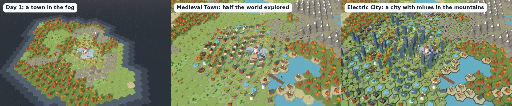

# BotWorld game design

BotWorld is one long game that chat plays together. It starts with a landing pad in a clearing, a few huts and sticks and stones, in the middle of a big world nobody has seen yet. Over about two months chat explores that world and grows the town through the history of the world, from the Stone Age past Ancient Egypt, the Roman Empire, the Middle Ages, the Industrial Revolution and the Modern Age into a glowing future city, building a famous wonder in every era. Nobody controls it but chat: every home, every project, every scouting trip and every vote comes from a chat command.

## The world

* **Big and made from a seed.** A hex map of 4,921 tiles (41 rings around the pad, about ten times the old island). The server and every page build the same map from the same seed, so the map itself is never sent around.
* **Land types:** grassland, berry meadows, forests, rocky hills, mountains (bots walk around them), lakes, rivers (bots wade through) and a sea coast on one side. In the hills and mountains lie **coal and iron deposits**; far out there are **ancient ruins** and **old stone tablets**.
* **Fog.** At the start only the land within 6 tiles of the pad is known. Everything else is fog, like in Age of Empires. Land is revealed by scouts (`!explore`), around every new building, and much further around towers and lighthouses. Explored land rises out of the fog on stream.
* **What scouts find:** ore deposits (needed for mines from the Middle Ages on), ruins (a gift of the goods the town has least of) and tablets (two hours of knowledge). Every map guarantees wood, stone and berries near the start, and coal and iron within about 13 tiles.

## Homes and town projects

* **Your own home.** `!home` builds one home per viewer, near the middle of town. It has a rim and a flag in the viewer's colour, so everyone can see whose it is, and `!me` puts an arrow and a column of light in your colour over your bot for 20 seconds and flies the camera to it. Everyone on a stream sees the same picture, so this is how a viewer finds their own bot. `!upgrade` makes it bigger (three levels), and every new era turns it into that era's kind of home (hut, mud brick house, villa, townhouse, apartments, skyscraper, arcology).
* **Everything else is built together.** `!build farm` starts a town project, at most three at a time (what the town is stuck on, the wonder's goods, food, power or a good a project waits for, may start as a fourth). It needs its goods first, then work: every bot that types `!help` adds one share of work per second, and the townsfolk always add a little, so a project also finishes when chat is asleep. A hut takes one bot about two minutes and four bots half a minute. Helpers earn XP for the time they put in, and the finished building is credited to its builders.
* **Short jobs.** Every command keeps a bot busy for about half a minute and then shows what it did, so chat keeps typing and sees progress. `!help` is a 40 second shift on a project (one share of work per second), `!work bricks` 60 seconds at a building, `!explore` a trip into the fog. Typed while the bot is busy, jobs wait in line, up to 5 (`!wood 3` lines up three, `!stop` clears the line). Every job pays a little XP, which pops up over the bot.
* **Gathering by hand.** `!wood`, `!stone` and `!food` (then `!marble` from the Roman Empire, and `!coal` and `!iron` from the Middle Ages) send your bot on one trip to the nearest known land of the right kind: a forest, rocky hills, a berry meadow (or the water with `!fish`), a coal or iron deposit. It walks out, works there 8 seconds and carries the crate back to the nearest store; the trip takes about half a minute near town and longer far out. Chat always has something useful to do, even before the first woodcutter stands. Buildings make more and keep going while chat sleeps. Goods made from other goods (bricks, steel, parts, chips) come only from their building; `!work bricks` sends your bot to help at a kiln.
* **Tools.** A bot starts with stone tools and carries 2 goods per trip. `!upgrade tools` buys the next set from the town storage once the viewer is high enough and the era has the material:

| Tools | Level | Era | Costs | Per trip | Building speed |
| --- | --- | --- | --- | --- | --- |
| Stone | 1 | Stone Age | | 2 | 1x |
| Copper | 3 | Ancient Egypt | 6 bricks, 6 wood | 3 | 1.25x |
| Iron | 6 | Middle Ages | 8 iron | 4 | 1.5x |
| Steel | 10 | Industrial Revolution | 8 steel | 5 | 1.75x |
| Power | 15 | Modern Age | 8 parts | 6 | 2x |
| Laser | 20 | Future | 6 chips | 8 | 2.5x |

* **Building upgrades.** `!upgrade woodcutter` (or `!upgrade #12`) starts a town project that takes a finished building to level 2, and later 3. It costs 1.5 times the building's price (2.25 times for level 3) and half its work per level, is built with `!help` like any project, and the building keeps working meanwhile. Every level makes 50% more of what it gives: goods, power, storage room, people or knowledge. Upgraded buildings fly a silver (level 2) or gold (level 3) pennant.
* **The land decides where.** The server picks the best known spot: woodcutters next to a forest, quarries next to rocky hills (marble quarries too, best by mountains), gatherers next to berries, fishers and harbors on the water, mines near a coal or iron deposit, farms on grassland. A spot with more of the right land around it produces more (up to 60% more, or 40% less on a poor spot). If no right spot is known yet, the town is told to explore.
* **A full town makes room.** When no free spot is left, a new building takes the place of one the town can spare, with a notice on stream. While people are content (happiness 80 or more), old decor makes way for anything: decor from an older era first (a campfire in the Future), then the commonest. When they are not, only what the town needs right now (what the plan box asks for, a new viewer's home, homes when people wait to move in) may replace decor. What the town needs may also replace a spare producer of goods the stores are full of (one of three or more), and newer decor may always replace older decor. Homes, stores, power plants, schools, food makers and wonders always stay; `!upgrade` grows a full town further.

## Outposts and the whole world

* **Outposts** (`!build outpost`, or `!build outpost north`) are small stores far out: the server puts them on rich, known land at least 6 tiles from any other store, a little further each time, and they reveal the land within 4 tiles.
* **Reach.** A producer within 4 tiles of a store (the landing pad, a stockpile, granary, warehouse or outpost) works at full speed; every tile further takes a tenth off, down to 40%. New producers prefer spots near a store, gatherers drop their loads at the nearest one, and the plan box suggests an outpost when producers are far from one.
* **Roads and carts.** A worn road runs from every outpost to the nearest store closer to the middle, and mule carts travel along it.

## The rival town

Cogsworth is an AI town about 27 tiles out, on the side of the world away from the sea. It plays by the same rules as chat, from the same catalog:

* A crew of 3 to 12 AI bots gathers what the town has least of and builds. About once an hour (at normal speed) it starts something: first whatever makes the goods its wonder and this era's buildings need, then food, homes, power, knowledge and happiness, then outposts (two more every era), upgrades and more of everything.
* Its economy, wonders and eras follow the town's rules: production with workers, happiness, power and reach, food for its people, knowledge over `eraDays`, the era's wonder and the people goal.
* **Land.** Tiles within two steps of a rival building are the rival's, and the town cannot build or gather there; the rival keeps out of the town's land the same way. Each side also keeps a home ground nobody else may build on: 13 tiles round the landing pad, 10 round Cogsworth's square. Both spread out over the map with their outposts and race for the forests, hills and ore deposits in between, and a full rival makes room the way the town does.
* **How it plays.** Power comes first (buildings without it make nothing), and solar farms are at most half its power plants, since they make nothing at night. It never adds makers of a good while the ones it has stand idle for lack of power or inputs, mines go for the ore it lacks, it builds campfires, schools and labs until knowledge comes as fast as it can, and decor only while its people are not content.
* **The race.** Both towns race on era progress: the era, plus how far the slowest of knowledge, the wonder and people is towards the next one (the next era needs all three, so a crowd of new homes in the first minutes is no lead). The race panel shows all three for both towns. The rival plays at 85% of a full pace (times `limits.rivalDifficulty`) and leans towards a close race: up to 45% faster when chat is ahead, up to 35% slower when chat is behind. So it usually reaches a new era first, and an active chat wins the last sprint to the Future.
* **Fog.** The rival is hidden until chat's scouts reach its land; then the camera goes to look, and its buildings show on the map with red edges and red bots at work. Until then the **Race to the Future** panel says which way it lies.

## Merchant Guild orders

The economic battle between the two towns happens at the Guild's wagon on the landing pad.

* **An order.** About every 75 minutes (`limits.contractEveryMin`), while someone in chat typed in the last 15 minutes and the town has a few buildings, the Merchant Guild posts an order: one good both towns know, newer goods more often and never the same twice in a row, about a tenth of the town's storage (at least 20). Both towns have 30 minutes (`limits.contractMin`) to fill it. Moderators can call the next order right away with `!deliver start`. A wagon with a gold canopy parks on the landing pad and the order shows in the race panel with both towns' bars.
* **Hauling.** `!deliver` sends your bot on a 30 second trip with crates from the pad to the wagon; when it is back, each crate it carried fills a fortieth of the order (2 crates with stone tools, 8 with laser tools, so a trip fills 5% to 20%). `!deliver 3` lines up three trips. The townsfolk haul 1.5% a minute on their own. The goods come out of the town's stock: no bricks, no delivery (the plan box then says how to make some).
* **The rival** hauls 1.5% a minute plus 2.5% a minute with a full crew (half that with a small one), times its lean towards a close race, out of its own stock. On its own it fills an order in about 20 to 35 minutes, so a chat that ignores the Guild loses, and one or two bots that keep hauling win.
* **Winning.** The first town to fill the order wins, or, when time runs out, whoever delivered more. The Guild pays one and a half times the goods' worth (a good is worth 1 plus its era: wood 1, bricks 2, marble 3, iron 4, steel 5, chips 6) in the two goods the winner has least of, and its scholars share 30 minutes of knowledge. Every bot that hauled for a winning order gets 8 XP (and 3 per trip). The loser gets its crates back. The score of orders won stays in the race panel, and the Gazette reports the wins.
* **Balance.** In the balance runs chat wins seven orders in ten with two regular viewers (132 of 187 over the game) and three in four with five (283 of 383). Cogsworth takes the orders chat is not around for.

## What chat sees

* **What to do now:** the top of the screen always shows the next steps with the command to type, worked out by the server. An open Guild order always comes first. Help the project that is being built, gather the goods a project waits for (`!wood`), start what the town needs (`!build quarry`), explore when the right land is missing, haul to the wonder, build more homes when people need room, or explore the fog.
* **Being built:** every project with its progress and helpers, and the homes going up.
* **The how-to card** takes turns showing the commands, where every good comes from (which building makes it and what land it needs) and this era's buildings with their costs. The goods page shows both ways for every good: the command to gather it by hand, and the building that makes it all day.

## The arc

| Era | What it is about | New goods | Wonders to choose from |
| --- | --- | --- | --- |
| 🪨 Stone Age | Huts, woodcutters, quarries, berry gatherers, fishing huts, totems | wood, stone, food | 🪨 Stonehenge or 🗿 the Moai |
| 🐪 Ancient Egypt | Mud brick houses, farms on irrigation canals, brick kilns, granaries, obelisks | bricks | 🔺 the Great Pyramid or 🪜 the Ziggurat of Ur |
| 🏛️ Roman Empire | Villas, marble quarries, temples, schools, fountains, statues | marble | 🏟️ the Colosseum or 🐉 the Great Wall |
| 🏰 Middle Ages | Townhouses, mines on coal and iron, castle towers, windmills, harbors, universities | coal, iron | ⛪ Notre Dame or 🛕 Angkor Wat |
| 🏭 Industrial Revolution | Apartment blocks, steel mills, factories, coal power plants, a train | steel, parts | 🗼 the Eiffel Tower or 🕰️ Big Ben |
| 🏙️ Modern Age | Skyscrapers, wind turbines, solar farms, chip fabs, labs, stadiums | chips | 🌆 the Empire State Building or 🎭 the Sydney Opera House |
| ✨ Future | Arcologies, fusion reactors, robot factories, a maglev | | 💠 the Fusion Spire or 🚀 the Space Elevator |

Finishing the Future's wonder is the finale. After that the town keeps going in the Future era.

## Wonders of the world

* **Two wonders an era, chat picks one.** Every era has two famous wonders from different parts of the world. As soon as either town reaches a new era (or the game starts) and someone in chat is around, a five minute vote asks which one BotWorld builds: `!vote 1` or `!vote 2` (`!1`, `!2`). The rival builds the other one. The vote comes before any event vote, and a moderator can start it right away with `!vote start`.
* **The rival is often ahead,** so chat usually votes when Cogsworth reaches the era first ("Cogsworth reached Ancient Egypt! Which wonder will BotWorld build?"), before getting there itself.
* **Fair either way.** Both wonders of an era need the very same goods, so the vote decides what rises, not how hard the race is. Until chat has chosen, the town's wonder is a building site with a sign asking chat to vote, and goods already go into it. With nobody voting (a tie goes to chance, so does an empty vote), chance decides when the vote ends, or when a wonder is finished before anybody voted.
* **On screen:** the vote card shows both wonders with where they are from, a banner names the winner and which one Cogsworth builds, and the wonders stand in the ring round the landing pad (the Future's just outside it, behind the pad). `/gallery.html?wonders=1` shows all fourteen.

## How an era ends

Three bars on screen, all three must be full:

1. **People.** Homes give room (your own home 3 to 5 people, a town hut 6, an arcology 140). People move in while there is food and the town is not miserable, and they eat food every minute.
2. **The wonder** chat chose. A big build in the ring around the landing pad. It takes goods a little at a time and always leaves a fifth of the storage room (at most 250 of each good) for normal builds. Bots on `!help wonder` carry crates to it and make it go faster. Nobody builds a wonder alone, so `!build wonder` (or its name, like `!build pyramid` or `!build eiffel tower`) does the same.
3. **Knowledge.** Grows with time: an era takes `eraDays` (default 9.5) days at base speed. Campfires, schools, universities and labs make it up to 50% faster, meteor showers and old tablets add hours at once.

This is what stretches the game to about two months: chat can speed it up, but even a busy chat cannot rush through an era in a day. The balance script (`npm run balance`) plays the whole game in pretend time:

| Era starts | 2 viewers | Cogsworth | 5 viewers | Cogsworth |
| --- | --- | --- | --- | --- |
| 🐪 Ancient Egypt | day 8.0 | day 7.6 | day 8.0 | day 7.5 |
| 🏛️ Roman Empire | day 16.2 | day 15.3 | day 15.8 | day 15.2 |
| 🏰 Middle Ages | day 24.2 | day 23.3 | day 23.8 | day 22.9 |
| 🏭 Industrial Revolution | day 32.3 | day 31.4 | day 31.8 | day 30.8 |
| 🏙️ Modern Age | day 40.4 | day 39.4 | day 39.7 | day 38.8 |
| ✨ Future | day 49.0 | day 47.5 | day 47.8 | day 46.8 |
| Finale (the Future's wonder done) | day 54.2 | about day 55 | day 53.0 | about day 54 |
| Guild orders won | 132 of 187 | 55 | 283 of 383 | 100 |

Each pretend viewer is online an hour and a half a day and types a command about every minute, and votes in every wonder vote. Because eras wait on knowledge, the finale lands in the eighth week whether two or five regulars play; a busy chat builds a much bigger town on the way (about 730 buildings with two viewers and 1,330 with five; a busy town fills every spot, and then old decor makes way). Cogsworth plays in the same runs: it enters every era half a day to a day and a half before chat (so chat usually votes on a wonder the moment Cogsworth gets there), and chat catches up in the Future. In both runs Cogsworth had its wonder and its people when chat's finale came, but still a tenth of its knowledge to go: about a day behind. At full pace (`limits.rivalDifficulty` 1.18) Cogsworth won both races by a nose.

When an era starts, older buildings that have a modern version rebuild themselves (a gatherer becomes a farm, a totem an obelisk and later a statue, an irrigation canal a windmill, huts become mud brick houses, a coal plant becomes a fusion reactor), homes become the new kind of home, and the town looks different: the roads, street lights, boats, bots and even the air change with the era.

Buildings that stay useful through many eras keep up with the times, the same building in a new look (`/gallery.html?looks=1` shows them all):

| Building | Looks, era by era |
| --- | --- |
| 🪓 Woodcutter | log cabin; a steam sawmill (Industrial Revolution); a lumber yard with a log loader (Modern Age); a tree farm under a glass dome with a drone (Future) |
| ⛏️ Quarry, marble quarry | a pit with a wooden hoist or treadwheel crane; an iron derrick and a steam engine; an excavator and a conveyor; a laser gantry with floating blocks |
| 🧱 Brick kiln | a domed kiln; a Hoffmann kiln with a tall chimney; a brickworks hall; a brick printer |
| 🏪 Market | stalls under awnings; a half timbered market hall (Middle Ages); a market hall of iron and glass; a supermarket; a glass dome with holo signs |
| ⚓ Harbor | a wooden quay with a sailing boat; a steamboat and an iron crane; a container port; a hover ship |
| ⚒️ Mine | a timbered tunnel; a pithead with a winding wheel (Industrial Revolution and Modern Age); a shaft of light under a dome |
| ⛺ Outpost | a tent camp; a palisade with a lookout (Middle Ages); shipping containers and a radio mast (Modern Age); a dome with a landing pad |
| 🌾 Farm | a mud and straw barn; a thatched barn with haystacks (Middle Ages); a red barn with a silo (Industrial Revolution) |
| 🗼 Lighthouse | the Pharos of Rome; a stone tower with a fire basket; a striped lighthouse (Industrial Revolution and Modern Age); a spire of light |
| ⛲ Fountain | a stone basin; rings of light (Future) |

The school (Roman, with a porch of columns and a sundial) and the well (Egyptian, of mud brick with a pulley) look like their own eras. The town's buildings follow the town's era and Cogsworth's follow Cogsworth's.

## The economy

Every 5 seconds the server runs one step:

* **Producers** make goods once a minute at full speed, if they have workers (people), the goods they need (a kiln eats stone and wood to make bricks) and power, scaled by how good their spot is. Helpers sent with `!work bricks` (and so on) add speed. Goods gathered by hand go straight into storage. Happy towns work faster.
* **Storage** limits every good (start 100, stockpiles, granaries and warehouses add room). A full store stops its producers.
* **Power** (from the Industrial Revolution) comes from coal plants (burn coal), wind turbines, solar farms (only by day, following the real sun) and fusion. Factories, skyscrapers and labs need it.
* **Happiness** comes from parks, gardens, fountains, statues, stadiums and other decor near homes, and drops when people are hungry or the power is out.

## Viewers

* Any command gives a viewer their own bot, with a colour and a hat. Bots land from the rocket on the pad.
* **XP** for building, helping, hauling, exploring, repairing, voting and coming back daily (streaks give more). Levels unlock hats.
* `!me` shows a card on stream (level, home, buildings helped, trips into the fog, rank) and flies the camera to your home. The top builders of the week are on screen too.

## Votes and events

About once an hour (when at least two people chatted in the last half hour) chat votes between three events with `!1`, `!2` or `!3`. Calm events also happen on their own now and then. A wonder vote (see above) always comes first.

| Event | Effect |
| --- | --- |
| 🎉 Festival | everyone happier for 30 minutes |
| 🌾 Big Harvest, 🌲 Tall Trees, 💎 Rich Veins | double food, wood, or stone, marble, coal and iron |
| ⛵ Merchant Ship | a gift of the goods the town has least of |
| ☄️ Meteor Shower | +3 hours of knowledge |
| 🔨 Builder Rush | building goes twice as fast |
| ⛈️ Storm | breaks 3 buildings until someone types `!repair` |
| 🔌 Blackout | breaks a power plant (Industrial Revolution and later) |

Moderators can start a vote with `!vote start` or an event with `!event storm`.

## The Gazette

Every half hour a newspaper headline about the town appears at the bottom of the stream. It is written from what happened since the last one: a new era, a finished wonder, storms, discoveries, level ups, new viewers, a building boom, what the town is short of. Templates write it out of the box; with an Anthropic API key Claude writes it.

## Every era and building

### 1. 🪨 Stone Age: Sticks and stones

To move on: 25 people, the wonder chat chose (🪨 Stonehenge from Britain or 🗿 Moai from Easter Island, 500 stone, 250 wood, 150 food) and a full knowledge bar.

| Build | Cost | Needs | What it does |
| --- | --- | --- | --- |
| 🛖 `hut` | 12 wood, 6 stone |  | homes for 6, becomes a mud brick house later |
| 🪓 `woodcutter` | 4 stone | next to a forest | makes 2 wood a minute, 2 workers |
| ⛏️ `quarry` | 6 wood | next to rocky hills | makes 2 stone a minute, 2 workers |
| 🫐 `gatherer` | 4 wood | next to a berry meadow | makes 2 food a minute, 1 worker, becomes a farm later |
| 🎣 `fisher` | 10 wood | next to water | makes 3 food a minute, 1 worker, becomes a harbor later |
| 🔥 `campfire` | 5 wood |  | +6 happiness nearby, knowledge +5% |
| 📦 `stockpile` | 12 wood |  | +60 storage, becomes a granary later |
| ⛺ `outpost` | 20 wood, 8 stone |  | +20 storage, a store far out that reveals the land around it |
| 🪶 `totem` | 6 wood, 14 stone |  | +14 happiness nearby, becomes an obelisk later |

### 2. 🐪 Ancient Egypt: Bricks on the Nile

To move on: 60 people, the wonder chat chose (🔺 Great Pyramid from Egypt or 🪜 Ziggurat of Ur from Sumer, 1000 stone, 600 bricks, 400 food) and a full knowledge bar.

| Build | Cost | Needs | What it does |
| --- | --- | --- | --- |
| 🏠 `mudhouse` | 10 wood, 10 bricks |  | homes for 9, becomes a villa later |
| 🌾 `farm` | 14 wood, 6 stone | on grassland | makes 5 food a minute, 2 workers, becomes a greenhouse later |
| 💧 `canal` | 12 wood, 12 stone |  | farms nearby +50%, 1 worker, becomes a windmill later |
| 🧱 `kiln` | 14 stone, 8 wood |  | 2 stone, 1 wood → 2 bricks a minute, 2 workers |
| 🪣 `well` | 15 stone |  | +10 happiness nearby, becomes a fountain later |
| 🏪 `market` | 16 wood, 10 bricks |  | +20 happiness nearby, 2 workers |
| 🌷 `garden` | 6 wood |  | +7 happiness nearby |
| 🌳 `park` | 8 wood, 4 stone |  | +10 happiness nearby |
| 🏺 `granary` | 20 wood, 10 bricks |  | +150 storage, becomes a warehouse later |
| 🗼 `obelisk` | 30 stone, 8 bricks |  | +18 happiness nearby, becomes a statue later |

### 3. 🏛️ Roman Empire: Marble, roads and arches

To move on: 110 people, the wonder chat chose (🏟️ Colosseum from Rome or 🐉 Great Wall from China, 1400 stone, 1000 bricks, 600 marble) and a full knowledge bar.

| Build | Cost | Needs | What it does |
| --- | --- | --- | --- |
| 🏡 `villa` | 16 bricks, 8 marble, 6 wood |  | homes for 13, becomes a townhouse later |
| ⛰️ `marblequarry` | 20 wood, 12 bricks | next to rocky hills | makes 2 marble a minute, 3 workers |
| 🏛️ `temple` | 30 marble, 16 stone |  | +26 happiness nearby |
| 🏫 `school` | 20 bricks, 6 marble, 10 wood |  | +5 happiness nearby, knowledge +10%, 2 workers, becomes an university later |
| 🗼 `lighthouse` | 40 stone, 12 bricks | next to the sea | +15 happiness nearby |
| ⛲ `fountain` | 24 stone, 10 marble |  | +18 happiness nearby |
| 🗽 `statue` | 30 marble, 10 stone |  | +25 happiness nearby, becomes a holo park later |

### 4. 🏰 Middle Ages: Castles, coal and iron

To move on: 180 people, the wonder chat chose (⛪ Notre Dame from Paris or 🛕 Angkor Wat from Cambodia, 2200 stone, 900 marble, 600 iron) and a full knowledge bar.

| Build | Cost | Needs | What it does |
| --- | --- | --- | --- |
| 🏘️ `townhouse` | 22 bricks, 14 stone, 3 iron |  | homes for 16, becomes an apartment block later |
| ⚒️ `mine` | 30 wood, 20 stone | near a coal or iron deposit | makes 2 coal, 1 iron a minute, 3 workers |
| 🏰 `tower` | 40 stone, 4 iron |  | +20 happiness nearby |
| 🌬️ `windmill` | 24 wood, 12 stone |  | farms nearby +50%, 1 worker |
| ⚓ `harbor` | 40 wood, 6 iron | next to the sea or a lake | makes 8 food a minute, 3 workers |
| 🎓 `university` | 36 stone, 20 bricks, 6 iron |  | +6 happiness nearby, knowledge +12%, 3 workers, becomes a research lab later |

### 5. 🏭 Industrial Revolution: Steam and steel

To move on: 320 people, the wonder chat chose (🗼 Eiffel Tower from Paris or 🕰️ Big Ben from London, 2500 bricks, 1800 steel, 500 parts) and a full knowledge bar.

| Build | Cost | Needs | What it does |
| --- | --- | --- | --- |
| 🏢 `apartments` | 45 bricks, 10 steel |  | homes for 32, becomes a skyscraper later |
| 🏭 `steelmill` | 50 bricks, 30 iron |  | 2 iron, 2 coal → 2 steel a minute, 4 workers |
| 🔥 `coalplant` | 40 bricks, 10 steel |  | burns 2 coal a minute, +20 power, 3 workers, becomes a fusion reactor later |
| ⚙️ `factory` | 60 bricks, 30 steel |  | 2 steel → 2 parts a minute, needs 8 power, 5 workers |
| 🏬 `warehouse` | 40 bricks, 10 steel |  | +400 storage |
| 🚉 `station` | 60 steel, 40 bricks |  | +30 happiness nearby, a train runs round the town |
| 💧 `watertower` | 20 steel |  | +15 happiness nearby |

### 6. 🏙️ Modern Age: Power for everyone

To move on: 600 people, the wonder chat chose (🌆 Empire State Building from New York or 🎭 Sydney Opera House from Sydney, 5000 steel, 2000 parts, 600 chips) and a full knowledge bar.

| Build | Cost | Needs | What it does |
| --- | --- | --- | --- |
| 🏙️ `skyscraper` | 70 steel, 24 parts |  | homes for 64, needs 6 power, becomes an arcology later |
| 🌀 `turbine` | 30 steel, 10 parts |  | +15 power |
| ☀️ `solar` | 20 steel, 16 parts |  | +20 power (by day) |
| 💾 `chipfab` | 60 steel, 40 parts |  | 2 parts → 1 chips a minute, needs 15 power, 6 workers |
| 🔬 `lab` | 40 steel, 10 chips |  | needs 6 power, knowledge +15%, 3 workers |
| ⚽ `stadium` | 120 steel, 40 parts |  | needs 5 power, +80 happiness nearby |
| 🌱 `greenhouse` | 30 steel, 10 parts |  | makes 20 food a minute, needs 4 power, 2 workers, becomes a vertical farm later |

### 7. ✨ Future: A bright tomorrow

To move on: 1200 people, the wonder chat chose (💠 Fusion Spire or 🚀 Space Elevator, 9000 steel, 3000 parts, 3000 chips) and a full knowledge bar.

| Build | Cost | Needs | What it does |
| --- | --- | --- | --- |
| 🌐 `arcology` | 130 steel, 45 chips |  | homes for 140, needs 10 power |
| ⚛️ `fusion` | 200 steel, 80 chips |  | +120 power, 4 workers |
| 🤖 `robofactory` | 150 steel, 60 chips |  | needs 20 power, every producer +25%, 2 workers |
| 🥬 `vertifarm` | 80 steel, 20 chips |  | makes 60 food a minute, needs 10 power, 2 workers |
| 🚄 `maglev` | 300 steel, 100 chips |  | +60 happiness nearby, a train runs round the town |
| 🌈 `holopark` | 20 steel, 20 chips |  | needs 4 power, +60 happiness nearby |
| 🛸 `droneport` | 120 steel, 60 chips |  | needs 10 power, wonder goes faster, 2 workers |

The full list, with build times, is in `public/shared/catalog.js`, the land rules in `public/shared/terrain.js`. Changing numbers there and running `npm run balance` shows how the pacing changes.
